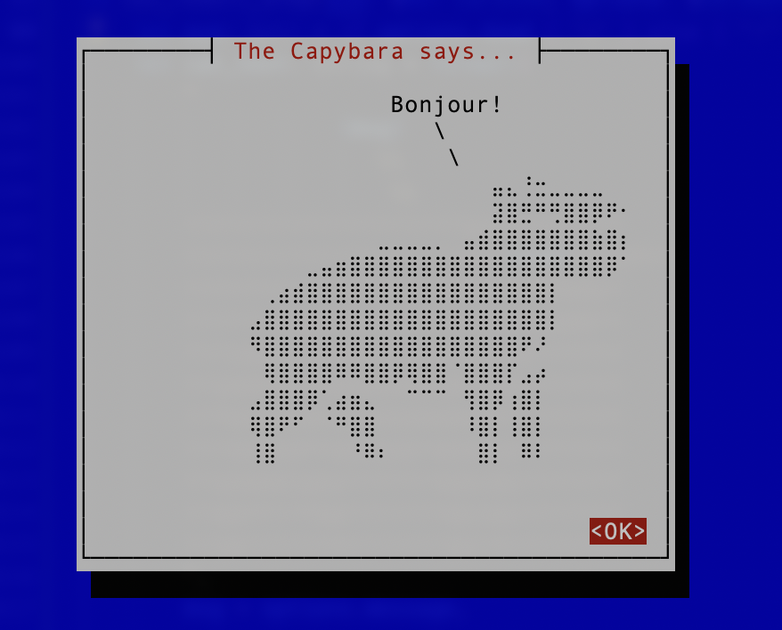

# Capysay

A Rust-based CLI tool for customizable Capybara ASCII art with colorful messages.

## Features

- **Custom Messages**: Specify any message for the Capybara to "say."
- **Dead Mode**: Add `X` eyes with a flag to make the Capybara appear "dead."
- **Colorful Output**: Styled text with the `colored` crate.
- **Identity Guard**: Ensures the Capybara retains its dignity (no "meowing").
- **TUI Mode**: A text-based user interface for crafting your Capybara messages interactively.
- **GUI Placeholder**: Stub for future GUI support.

## Installation

Requires [Rust](https://www.rust-lang.org/):

```bash
cargo install capysay
```

## Usage

### CLI

Run Capysay from the command line with various options:

```bash
# Default mode
capysay

# Custom message
capysay default "Hello, world!"

# Dead mode
capysay default --dead
```

### TUI Mode

Launch an interactive terminal UI to create Capybara messages:

```bash
capysay tui
```

### GUI Mode (Placeholder)

Currently a placeholder for future GUI support:

```bash
capysay gui
```

## Examples

### Default CLI Mode

```text
        Libenter homines id quod volunt credunt!
                       \
                        \
⠀⠀⠀⠀⠀⠀⠀⠀⠀⠀⠀⠀⠀⠀⠀⠀⠀⠀⠀⣤⣄⢘⣒⣀⣀⣀⣀⠀⠀⠀
⠀⠀⠀⠀⠀⠀⠀⠀⠀⠀⠀⠀⠀⠀⠀⠀⠀⠀⠀⣽⣿⣛⠛⢛⣿⣿⡿⠟⠂⠀
⠀⠀⠀⠀⠀⠀⠀⠀⠀⠀⠀⣀⣀⣀⣀⡀⠀⣤⣾⣿⣿⣿⣿⣿⣿⣿⣷⣿⡆⠀
⠀⠀⠀⠀⠀⠀⣀⣤⣶⣿⣿⣿⣿⣿⣿⣿⣿⣿⣿⣿⣿⣿⣿⣿⣿⣿⣿⡿⠁⠀
⠀⠀⠀⢀⣴⣾⣿⣿⣿⣿⣿⣿⣿⣿⣿⣿⣿⣿⣿⣿⣿⣿⣿⡇⠀⠀⠀⠀⠀⠀
⠀⠀⣠⣿⣿⣿⣿⣿⣿⣿⣿⣿⣿⣿⣿⣿⣿⣿⣿⣿⣿⣿⣿⡇⠀⠀⠀⠀⠀⠀
⠀⠀⠻⣿⣿⣿⣿⣿⣿⣿⣿⣿⣿⣿⣿⣿⣿⣿⣿⣿⣿⠟⠜⠀⠀⠀⠀⠀⠀⠀
⠀⠀⠀⢿⣿⣿⣿⣿⠿⠿⣿⣿⡿⢿⣿⣿⠈⣿⣿⣿⡏⣠⡴⠀⠀⠀⠀⠀⠀⠀
⠀⠀⣠⣿⣿⣿⡿⢁⣴⣶⣄⠀⠀⠉⠉⠉⠀⢻⣿⡿⢰⣿⡇⠀⠀⠀⠀⠀⠀⠀
⠀⠀⢿⣿⠟⠋⠀⠈⠛⣿⣿⠀⠀⠀⠀⠀⠀⠸⣿⡇⢸⣿⡇⠀⠀⠀⠀⠀⠀⠀
⠀⠀⢸⣿⠀⠀⠀⠀⠀⠘⠿⠆⠀⠀⠀⠀⠀⠀⣿⡇⠀⠿⠇⠀⠀⠀⠀⠀⠀⠀
█─▄▄▄─██▀▄─██▄─▄▄─█▄─█─▄█─▄▄▄▄██▀▄─██▄─█─▄█
█─███▀██─▀─███─▄▄▄██▄─▄██▄▄▄▄─██─▀─███▄─▄██
▀▄▄▄▄▄▀▄▄▀▄▄▀▄▄▄▀▀▀▀▄▄▄▀▀▄▄▄▄▄▀▄▄▀▄▄▀▀▄▄▄▀▀
```

### TUI Mode



### GUI Mode

The GUI mode is a placeholder and will print:

```text
Launching Capysay in GUI mode...
```

## Libraries Used

- **[clap](https://docs.rs/clap/)**: For parsing CLI arguments and subcommands.
- **[colored](https://docs.rs/colored/)**: To add colors and styles to terminal output.
- **[cursive](https://docs.rs/cursive/)**: To create the TUI mode.

## ASCII Art Source

ASCII art from [Emoji Combos](https://emojicombos.com/capybara-ascii-art).

## License

MIT License. See `LICENSE` for details.